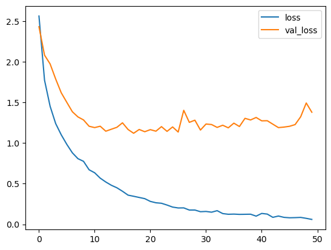

# Classical_Music_Classifier
 A CNN to classify classical music pieces based on their composer.

 Dataset used: MusicNet https://www.kaggle.com/datasets/imsparsh/musicnet-dataset

 Accuracy Results:
    - Version 1: accuracy of 68% on test data
    
    Slight rebound in validation loss curve indicating a bit of overfitting. However, validation loss for the most part seems stable so I believe the model is most likely getting stuck.
    Probably requires more training data, and potentially a bit more dropout or early stopping to correct the overfit . Next step, modify preprocessing script to utilize 
    a whole sound file instead of just the portion given by the shortest track in the dataset, in order to acquire more training data. 